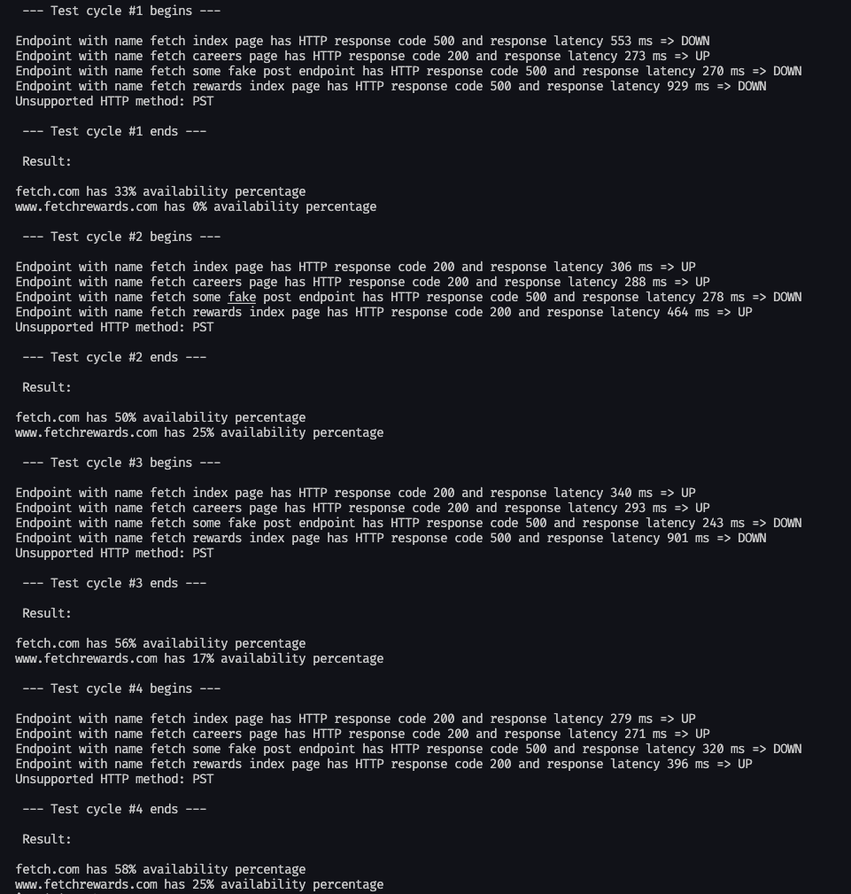

# HTTP Health Check Project

This Python project performs health checks on a set of HTTP endpoints, tracking availability percentages over time.

## Prerequisites

Before you begin, ensure you have Python installed on your machine. If not, you can download and install it from the official Python website: [Python Downloads](https://www.python.org/downloads/)

## Setting Up Virtual Environment

It's a good practice to use a virtual environment to isolate project dependencies. Follow these steps to create and activate a virtual environment:

1. Open a terminal or command prompt.

2. Navigate to the project directory.

3. Run the following commands:

   ```bash
   # On macOS/Linux
   python3 -m venv venv

   # On Windows
   python -m venv venv
   ```

## Activate the Virtual Environment

    ```bash
    # On macOS/Linux
    source venv/bin/activate

    # On Windows
    .\venv\Scripts\activate
    ```

## Installing Dependencies

Install the required Python packages by running:

```bash
pip install -r requirements.txt
```

This command will install the necessary dependencies specified in the requirements.txt file.

## Running the Project

Now that the virtual environment is set up and dependencies are installed, you can run the project. Execute the following command:

``` bash
python health_check.py
```

You can also add and modify endpoints in the config.yaml or replace it with your configuration file.

The program will continuously perform health checks on the specified HTTP endpoints, logging availability percentages over time. Press Ctrl+C to exit the program.

## Expected output


